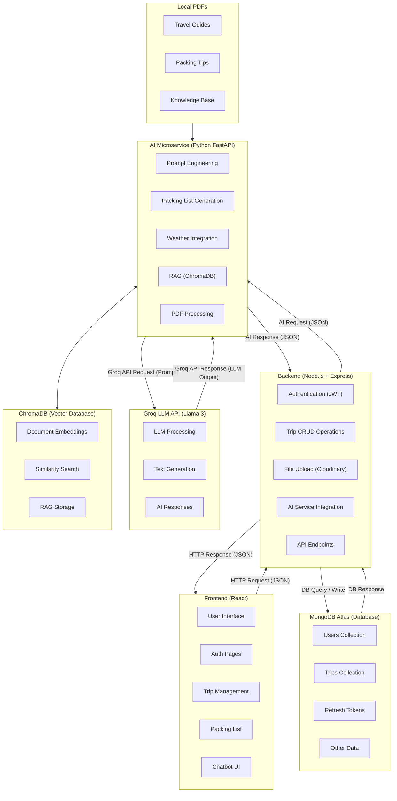
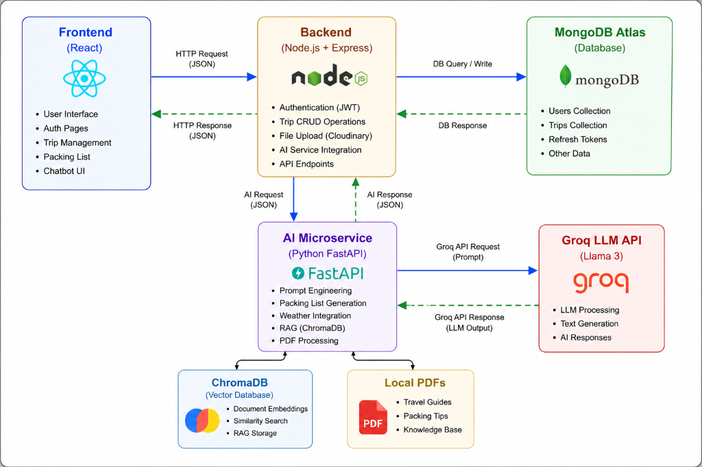

# 🌍 PackMate: AI-Powered Smart Travel & Packing Assistant

[](https://opensource.org/licenses/MIT)
[](https://reactjs.org/)
[](https://nodejs.org/)
[](https://fastapi.tiangolo.com/)
[](https://groq.com/)
[](https://www.trychroma.com/)
[](https://www.mongodb.com/cloud/atlas)

**PackMate** is an enterprise-grade, full-stack, AI-powered travel management system. It automates trip planning, generates weather-conscious packing lists, performs **Vision AI suitcase verification**, provides **RAG-based travel advisory chat**, and offers end-to-end trip journaling with photo management.

Built with a decoupled microservice architecture, PackMate pairs a **React frontend**, a **Node.js/Express API gateway**, a **Python FastAPI GenAI microservice**, a **MongoDB Atlas database**, and a **ChromaDB vector database**.

---

## 🎯 Key Highlights & Value Proposition

- 🤖 **Context-Aware AI Generation**: Leverages LLMs (Groq / Llama 3) and real-time weather forecasts (OpenCage Geocoding) to auto-generate personalized packing lists tailored to duration, destination, activities, and luggage limits.
- 👁️ **Vision AI Suitcase Analysis**: Allows travelers to upload photos of their packed or unpacked bags. The Vision AI model inspects the image and automatically reconciles item status against the packing list.
- 💬 **RAG Travel Chatbot**: Intelligent travel advisor backed by ChromaDB vector search and local travel guide PDFs, delivering precise advice without hallucinating.
- 📄 **Streaming DOCX Export**: Converts interactive packing lists into beautifully formatted, downloadable Microsoft Word (`.docx`) documents on demand.
- 🔐 **Production-Ready Security**: Enforces JWT authentication, refresh token rotation, bcrypt password hashing, rate limiting, and payload validators.

---

## 🏗️ System Architecture & Design

PackMate is engineered using a **decoupled microservices architecture** to ensure modularity, independent scalability, and clean separation of concerns.

### High-Level Architecture Diagram



---

## 🖼️ Architecture Image

<div align="center">
  
  <p><em>High-level architecture showing React Frontend, Node.js Backend Gateway, MongoDB Atlas, FastAPI GenAI Service, Groq LLM API, ChromaDB Vector DB, and Local Knowledge Base.</em></p>
</div>

---

## 📸 Application Screenshots

<div align="center">

### 🏠 Landing Page

<p><em>Modern landing page featuring theme switching, travel highlights, and quick feature access.</em></p>

### 🔑 Authentication & Login

<p><em>Secure JWT login interface with password hashing and session management.</em></p>

### 💡 How It Works

<p><em>Interactive workflow guide explaining the AI packing generation lifecycle.</em></p>

### 📋 AI Packing List Generation

<p><em>Real-time packing list generation tailored to weather forecasts and activity types.</em></p>

### 👤 User Account & Profile

<p><em>User profile dashboard displaying trip stats, active itineraries, and settings.</em></p>

### 📞 Contact & Support

<p><em>User feedback and support communication channel.</em></p>

</div>

---

## 🔄 End-to-End Data Flow

### 1. AI Packing List Generation Flow
1. **User Request**: User fills out destination, dates, trip type, luggage type, travelers, and food preferences on the React Frontend.
2. **Gateway Verification**: React sends an authenticated POST request to Node.js Backend (`/api/ai/generate-packing-list`). Node validates the JWT and checks rate limits.
3. **AI Service Call**: Backend proxies the request to FastAPI GenAI Service (`/generate-packing-list`).
4. **Weather Fetching**: FastAPI queries the OpenCage Geocoding API to retrieve coordinates and computes multi-day weather conditions.
5. **LLM Prompt Execution**: FastAPI formats a structured system prompt and invokes Groq (Llama 3).
6. **Caching & Response**: Result is saved in an in-memory TTL cache (5 min) and returned back to the Frontend.
7. **Database Sync**: When the user saves the trip, the list is persisted to MongoDB Atlas inside the user's trip document.

### 2. Vision AI Suitcase Analysis Flow
1. **Image Capture**: User uploads a photo of their suitcase bag/contents.
2. **Validation**: FastAPI inspects the image base64 format and validates image clarity.
3. **Vision LLM Processing**: The image is analyzed alongside weather conditions and current trip items using Groq Vision capabilities.
4. **Reconciliation**: The model returns packed vs. missing items and auto-updates item checkmarks.

### 3. RAG Travel Advisor Chatbot Flow
1. **PDF Ingestion**: Local travel guides and packing tips in `genai/app/knowledge_base/pdfs` are chunked and converted into vector embeddings using HuggingFace sentence transformers.
2. **ChromaDB Indexing**: Embeddings are stored in ChromaDB vector database collections.
3. **User Query**: When a user chats with the AI Travel Advisor, a similarity search retrieves relevant PDF context chunks.
4. **Augmented Prompt**: Groq Llama 3 synthesizes a contextualized response using the retrieved knowledge chunks.

---

## 🛠️ Microservices & Tech Stack Breakdown

### 1. Frontend (`/frontend`)
- **Framework**: React.js 18
- **Routing**: React Router v6
- **HTTP Client**: Axios with request/response interceptors
- **Styling**: Modern CSS3, responsive design, dark/light theme options
- **State Management**: React Context API & Hooks

### 2. Backend API Gateway (`/backend`)
- **Runtime**: Node.js & Express.js
- **Database**: MongoDB Atlas via Mongoose ODM
- **Authentication**: JSON Web Tokens (JWT) + HTTP-only Refresh Tokens + `bcryptjs`
- **Media Management**: Cloudinary SDK (Image storage for trip photos)
- **Security & Utilities**: `express-rate-limit`, `cors`, custom request validators

### 3. AI Microservice (`/genai`)
- **Framework**: Python 3.10+ & FastAPI
- **LLM Provider**: Groq API (`llama3-70b-8192` / `llama-3.2-11b-vision-preview`)
- **Vector Database**: ChromaDB
- **Embeddings**: `sentence-transformers` / HuggingFace
- **Weather API**: OpenCage Geocoding API
- **Document Processing**: `python-docx` for `.docx` creation, `pypdf` / `langchain` text splitters for PDF RAG ingestion

---

## 📡 API Endpoint Specification

### 🔑 Auth Endpoints (`/api/auth`)
| Method | Endpoint | Description | Auth Required |
| :--- | :--- | :--- | :---: |
| `POST` | `/api/auth/register` | Register a new user account | ❌ |
| `POST` | `/api/auth/login` | Authenticate user & issue JWT tokens | ❌ |
| `POST` | `/api/auth/refresh` | Refresh access token using refresh token | ❌ |
| `POST` | `/api/auth/logout` | Revoke tokens & clear session | 🟢 |

### 🗺️ Trip Management Endpoints (`/api/trips`)
| Method | Endpoint | Description | Auth Required |
| :--- | :--- | :--- | :---: |
| `GET` | `/api/trips` | Fetch all trips for authenticated user | 🟢 |
| `POST` | `/api/trips` | Create a new trip with packing items | 🟢 |
| `GET` | `/api/trips/:id` | Fetch specific trip details by ID | 🟢 |
| `PUT` | `/api/trips/:id` | Update trip details or packing list | 🟢 |
| `DELETE`| `/api/trips/:id` | Delete trip itinerary | 🟢 |
| `POST` | `/api/trips/:id/photos` | Upload trip photos to Cloudinary | 🟢 |

### 🤖 AI Service Endpoints (`/api/ai` & FastAPI)
| Method | Endpoint | Description | Provider |
| :--- | :--- | :--- | :---: |
| `POST` | `/api/ai/prefetch-weather` | Fetch weather summary for trip dates | OpenCage / Weather API |
| `POST` | `/api/ai/generate-packing-list` | Generate weather-aware packing list | Groq Llama 3 |
| `POST` | `/api/ai/download-packing-list` | Export packing list as `.docx` file | `python-docx` |
| `POST` | `/api/ai/analyze-suitcase` | Vision AI photo scan of packing bag | Groq Vision LLM |
| `POST` | `/travel-chat` | RAG travel advisory chat query | ChromaDB + Llama 3 |

---

## 💻 Local Setup & Installation Guide

### Prerequisites
- **Node.js** (v18.x or higher) & **npm**
- **Python** (v3.10 or higher)
- **MongoDB Atlas** database connection URI
- **Groq API Key** ([console.groq.com](https://console.groq.com/))
- **OpenCage API Key** ([opencagedata.com](https://opencagedata.com/))
- **Cloudinary Account** credentials (for photo uploads)

---

### 1. Environment Configuration

Create `.env` files in each service directory:

#### `backend/.env`
```env
PORT=5000
MONGO_URI=mongodb+srv://<username>:<password>@cluster.mongodb.net/packmate
JWT_SECRET=your_super_secret_jwt_key
JWT_REFRESH_SECRET=your_super_secret_refresh_key
GENAI_SERVICE_URL=http://127.0.0.1:8000
GENAI_API_KEY=your_genai_microservice_api_key
CLOUDINARY_CLOUD_NAME=your_cloud_name
CLOUDINARY_API_KEY=your_api_key
CLOUDINARY_API_SECRET=your_api_secret
```

#### `genai/.env`
```env
PORT=8000
GROQ_API_KEY=your_groq_api_key
OPENCAGE_API_KEY=your_opencage_api_key
API_KEY=your_genai_microservice_api_key
```

#### `frontend/.env`
```env
REACT_APP_API_URL=http://localhost:5000/api
REACT_APP_GENAI_URL=http://localhost:8000
REACT_APP_GENAI_API_KEY=your_genai_microservice_api_key
```

---

### 2. Microservices Setup & Execution

#### 🔹 Step A: Backend API Gateway (Node.js)
```bash
cd backend
npm install
npm start
```
*Backend will start on `http://localhost:5000`*

---

#### 🔹 Step B: AI Microservice (Python FastAPI)

**On Windows:**
```bash
cd genai
python -m venv venv
venv\Scripts\activate
pip install -r requirements.txt
python -m app.knowledge_base.ingest
uvicorn main:app --reload --port 8000
```

**On macOS / Linux:**
```bash
cd genai
python3 -m venv venv
source venv/bin/activate
pip install -r requirements.txt
python3 -m app.knowledge_base.ingest
uvicorn main:app --reload --port 8000
```
*FastAPI GenAI Service will start on `http://127.0.0.1:8000`*

---

#### 🔹 Step C: Frontend UI (React)
```bash
cd frontend
npm install
npm start
```
*Frontend application will open on `http://localhost:3000`*

---

## 📂 Project Directory Structure

```text
PackMate_deployed/
├── assets/                       # Screenshots, System Architecture Diagrams
│   ├── AccountPage.png
│   ├── Contact.png
│   ├── Generating_PackingList.png
│   ├── HowItWorks.png
│   ├── LandingPage.png
│   ├── Login.png
│   └── System_Design.png
├── backend/                      # Node.js & Express API Gateway
│   ├── config/                   # DB, Cloudinary & environment configs
│   ├── controllers/              # Auth, Trip & AI route controllers
│   ├── middlewares/              # Auth JWT middleware, Rate limiting, Uploads
│   ├── models/                   # Mongoose Data Models (User, Trip, Tokens)
│   ├── routes/                   # Auth, Trips & AI Express routers
│   ├── services/                 # Business logic & Axios GenAI proxy
│   ├── validators/               # Input schema validation rules
│   ├── app.js                    # Express application setup
│   └── server.js                 # Server entry point
├── genai/                        # Python FastAPI AI Microservice
│   ├── app/
│   │   ├── config/               # Settings, logging & API keys
│   │   ├── knowledge_base/       # RAG Vector Ingestion & PDF Store
│   │   │   ├── chroma_db/        # Persistent ChromaDB vector data
│   │   │   ├── pdfs/             # Travel guides & packing checklists
│   │   │   └── ingest.py         # Embedding generation script
│   │   ├── routes/               # FastAPI endpoints (chat, packing, suitcase, weather)
│   │   ├── schemas/              # Pydantic data validation schemas
│   │   └── services/             # Groq LLM, RAG retriever, Vision analyzer logic
│   ├── Dockerfile                # Docker container configuration
│   ├── main.py                   # FastAPI entry point
│   └── requirements.txt          # Python dependencies
├── frontend/                     # React Single Page Application
│   ├── public/                   # Static assets & index.html
│   ├── src/
│   │   ├── components/           # Reusable components (Navbar, Footer, SuitcaseAnalyzer, etc.)
│   │   ├── pages/                # Page views (Home, Login, PackingAssistant, TripDetails, etc.)
│   │   ├── App.js                # Router configuration
│   │   └── index.js              # React DOM entry point
│   └── vercel.json               # Vercel deployment configuration
└── README.md                     # Complete System Documentation
```

---

## 🚀 Cloud Deployment Architecture

- **Frontend**: Deployed on **Vercel** (`https://packmatefrontend.vercel.app`)
- **Backend API Gateway**: Deployed on **Render** (`https://packmate-backend.onrender.com`)
- **AI Microservice**: Deployed on **Render** (`https://packmate69.onrender.com`)
- **Database**: **MongoDB Atlas** (Managed Cloud Database)
- **Media Assets**: **Cloudinary CDN**

*Note: Services hosted on Render free tier may require up to 30 seconds to spin up after periods of inactivity.*

---

## 🛡️ License

Distributed under the **MIT License**. See `LICENSE` for more information.

---

<div align="center">
  <sub>Built with ❤️ by the PackMate Engineering Team</sub>
</div>
